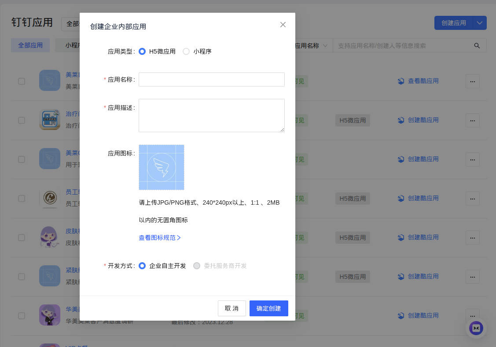
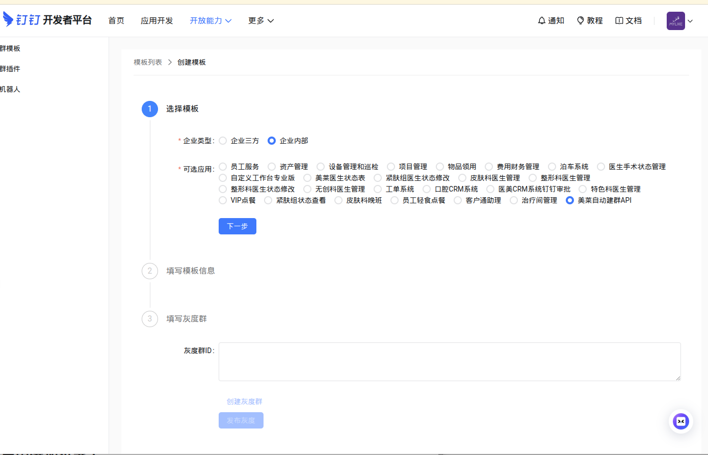

# 自动建群流程

## 成为开发者

https://open.dingtalk.com/document/dingstart/dingtalk-developer

## 创建 H5 微应用

+ 点击委托服务商开发 -> 
  + 应用类型：H5微应用
  + 开发方式：企业自主开发
  + 命名不能有空格

https://open.dingtalk.com/document/orgapp/create-an-h5-micro-application

## 应用内添加机器人

https://open.dingtalk.com/document/development/development-robot-overview?spm=a2q3p.21071111.0.0.4929TxbCTxbCAT

## 创建群模板

+ 可选应用，选择创建的 H5 微应用

https://open-dev.dingtalk.com/fe/im?spm=ding_open_doc.document.0.0.432827e2jKgyS3#/group/list

## 开通相关接口权限

### 根据手机号获取成员基本信息权限

[qyapi_get_member_by_mobile]，点击链接申请并开通即可：https://open-dev.dingtalk.com/appscope/apply?content=cliowdul0snq9dnukx6%23qyapi_get_member_by_mobile,

## 相关接口

### 获取 AccessToken

https://open.dingtalk.com/document/development/obtain-the-access-token-of-an-internal-app?spm=ding_open_doc.document.0.0.15d327e2IajId6

## 创建群

https://open.dingtalk.com/document/development/create-a-scene-group-v2